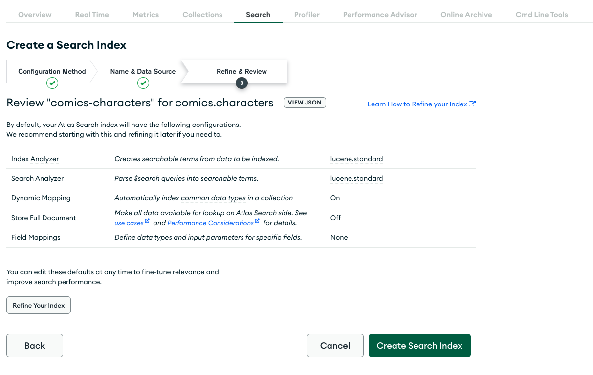

# Compass gives you Query API superpowers!

MongoDB provides the world’s leading application data platform. The document model and the MongoDB Query API give you a flexible and powerful way to manage, interact with, and obtain insights from your data.

You can combine more than 30 different stages and hundreds of operators to query and transform your documents. While this may seem daunting, we have you covered! The complexity of the Query API doesn’t need to be your kryptonite. You can use MongoDB Compass to make this experience much easier and more enjoyable. 

In this workshop, we’ll walk you through the new aggregation experience in Compass and how to use it effectively in your development workflows. We’ll load a sample dataset into MongoDB and see how we can use aggregations to clean the data and get it ready to build an application on top of it. Then, we’ll play around with the data: we’ll write some queries and aggregations, see how we can translate them into code to build an application in your favorite programming language, and explore how to optimize performance.

To get the most out of this session you should be able to write at least simple queries and have familiarity with programming in general. Install Compass ahead of time and bring your laptop with you to this session.
You’ll walk away with a solid understanding of how to use Compass and the other MongoDB developer tools to create effective queries and aggregations. We’ll also give you a sneak peek into what we’ll be doing next to give you aggregation superpowers.

## The Workshop

In this workshop, you'll import some data into MongoDB with Compass, and you will use the aggregation framework to explore it and extract insights from it. You will also be able to take advantage of the Export to Language functionality to
transform your aggregations to code.

Depending on your interests, experience and technical skills, you can choose to follow this guide more or less loosely. Build what you like and have as much fun as possible!

**We recommend cloning this repository on your computer to have all the material readily available.**

### What you need

To make the best out of this workshop, we recommend setting up the following:

 1. An Atlas cluster (free-tier should be enough). Follow [these steps](link-to-docs) to set one up.
 2. [Compass](https://www.mongodb.com/docs/compass/current/install/) connected to your Atlas cluster.
 3. Your favorite programming language and framework. As an example, we provide the skeleton of a web application built with ... that should be fairly easy to work with, but you should feel free to use whatever language and framework you feel most comfortable with.

### Import the data into MongoDB

We'll start with importing our dataset into MongoDB. To do this, we'll use Compass.

Create a `superheroes_game` database with the 3 collections below.

 1. `superheroes_cards` collection
 2. `users` collection
 3. `games` collection

In the `superheroes_cards` collection, import [dataset/superheroes-cards.json](./dataset/superheroes-cards.json).
 
In the `users` collection, import [dataset/superheroes-cards.json](./dataset/users.json).
 
In the `games` collection, import [dataset/superheroes-cards.json](./dataset/games.json).

At this point, you should have everythig it takes to start working with your data.

If you'd like, you can verify everything was imported correctly by opening the shell in Compass and doing:

```javascript
db.getSiblingDB('superheroes_game').users.findOne({username: 'Pavel_Ramos26'}).country === 'MQ' &&
db.getSiblingDB('superheroes_game').superheroes_cards.findOne({name: 'Atom Girl'}).id === 52 &&
db.getSiblingDB('superheroes_game').games.findOne({_id: ObjectId('628b5c24ff7e14826f6d92da')}).v === 2 ? 'All good' : 'Something went wrong'
```

### Recreate the Good vs Evil battle

Note: in the live demo, we used a [`$topN`](https://www.mongodb.com/docs/upcoming/reference/operator/aggregation/topN/) accumulator in the `$group` stage. This is a feature introduced in MongoDB 5.2.

You can achieve something similar to `$topN` by using the `$group` with a `$push` accumulator and a subsequent stage to `$slice` the array to the first `10` elements.

Here are the powerstats multipliers:

| Powerstat    	| Multiplier 	|
|--------------	|------------	|
| intelligence 	| 3          	|
| strength     	| 1.5        	|
| speed        	| 1.3        	|
| durability   	| 2.2        	|
| power        	| 1.1        	|
| combat       	| 1          	|

<details>
<summary>Good 🦸🏼‍♀️ vs Evil 🦹🏻‍♂️ battle aggregation</summary>

```javascript
[{
    $match: {
      "biography.alignment": {
        $ne: 'neutral'
      }
    }
  },
  {
    $sample: {
      size: 150
    }
  },
  {
    $group: {
      _id: '$biography.alignment',
      powerstats: {
        $topN: {
          n: 10,
          output: '$powerstats',
          sortBy: {}
        }
      }
    }
  },
  {
    $set: {
      score: {
        $reduce: {
          input: '$powerstats',
          initialValue: 0,
          in: {
            $add: [
              '$$value',
              {
                $multiply: [3, '$$this.intelligence']
              },
              {
                $multiply: [1.5, '$$this.strength']
              },
              {
                $multiply: [1.3, '$$this.speed']
              },
              {
                $multiply: [2.2, '$$this.durability']
              },
              {
                $multiply: [1.1, '$$this.power']
              },
              {
                $multiply: [1, '$$this.combat']
              }
            ]
          }
        }
      }
    }
  },
  {
    $unset: 'powerstats'
  }
]
```

</details>

#### Check your indexes!

This pipeline does a collection scan. That's bad! It means your aggregation needs to scan through *all* the documents in your collection. This is something you can live with if you collection is not very big, but can become problematic as your application scales.

The good news is that a collection scan is often easy to avoid by adding the right index.

 1. Use the built-in Explain plan functionality available in the aggregation builder to take a look at the performance of your aggregation.
 2. Then add the index that you think you need to avoid doing a collection scan every time.
 3. Check the explain plan again to make sure the behavior and performance is now what you expect.

#### 💡 How to make this more interesting

Create a [HTTPS endpoint](https://www.mongodb.com/docs/atlas/app-services/endpoints/configure/) in MongoDB Atlas App Services that users a function to generate the battle. The function could return not only the total score for the Good and Evil teams but also the cards that were used for the battle. This way, you could have a simple web page that calls the endpoint and displays the cards.

### Leaderboard

You will now build a leaderboard for this Superheroes game.

We want the leaderboard to contain the 10 users who won the biggest number of games.

<details>
<summary>Leaderboard aggregation</summary>

```javascript
[{
    $match: {
      winner: {
        $ne: null
      }
    }
  },
  {
    $group: {
      _id: '$winner',
      totalWins: {
        $sum: 1
      }
    }
  },
  {
    $sort: {
      totalWins: -1
    }
  },
  {
    $limit: 10
  },
  {
    $lookup: {
      from: 'users',
      localField: '_id',
      foreignField: '_id',
      as: 'user'
    }
  },
  {
    $replaceWith: {
      $mergeObjects: [{
          $arrayElemAt: [
            '$user',
            0
          ]
        },
        {
          totalWins: '$totalWins'
        }
      ]
    }
  }
]
```

</details>

Now that you've built your aggregation to compute the leaderboard, try to export it to your favorite programming language and use it from there.

#### 💡 How to make this more interesting

Here are a few suggestions to take this exercise beyond the basics:

 * Use your favorite programming language to display the leaderboard on a webpage, on the terminal, or any other application and screen factor you'd like.
 * Create a [HTTPS endpoint](https://www.mongodb.com/docs/atlas/app-services/endpoints/configure/) in MongoDB Atlas App Services for the leaderboard. Then display the results on a webpage or any other place you'd like or integrate the leaderboard with some other online services.
 * If you want to do some more advanced aggregating, try to build readerboards by country, i.e. the top 10 players from a given country. Hint: the data in the `games` collection might not be structured in the best way to support this use case. You may want to restructure it a bit, or create a materialized view (see `$out` and `$merge`), potentially in combination with an Atlas trigger.

<hr>

### Superheroes catalog

One use-case you will find very often in the applications you build is full text search. In our case, with this big catalog of
superheroes, we may want to help users find information for a character of which they don't remember the name very well.

We can support that by enabling full text search on our `superheroes_cards` collection with the power of Atlas Search. That requires sligthly more
setup than your usual index, but it's quite straightforward to do. Head over to your Atlas account and create a search index
for the `superheroes_cards` collection. The default settings will do.



Now full text fuzzy search is just one aggregation stage away.

<details>
<summary>Full text search by name</summary>

```javascript
[{
  $search: {
    index: 'default',
    text: {
      query: '<name to search>',
      path: 'name',
      fuzzy: {}
    }
  }
}]
```
</details>

#### 💡 How to make this more interesting

Here are a few suggestions to take this exercise beyond the basics:

 * Play around with all the different aspects of Atlas Search and tweak the accuracy of the fuzzy matching
 * Build a [HTTPS endpoint](https://www.mongodb.com/docs/atlas/app-services/endpoints/configure/) for the full text search functionality
 * Make a simple superheroes search application