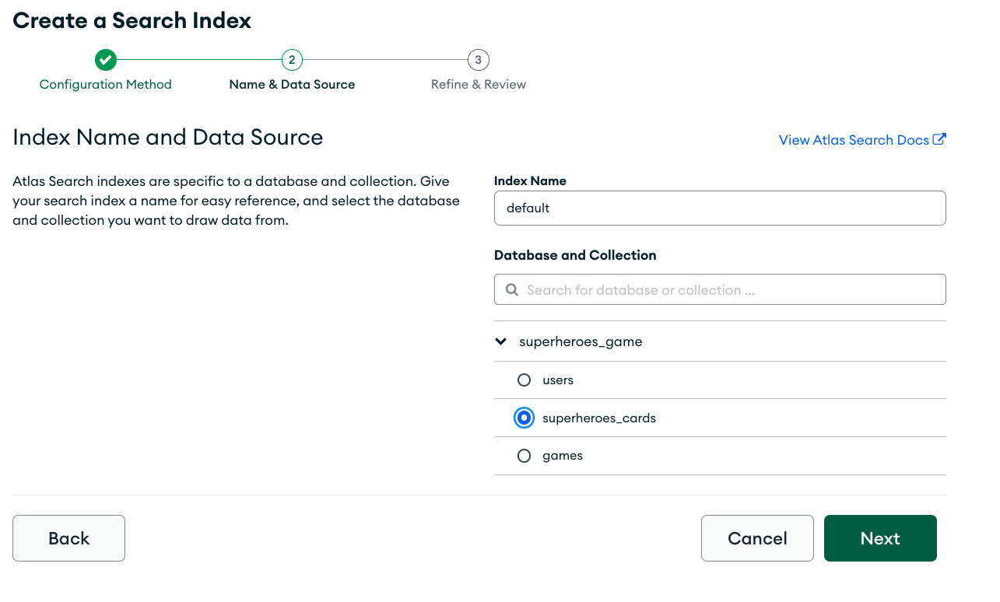

# Compass gives you Query API superpowers!

MongoDB provides the world’s leading application data platform. The document model and the MongoDB Query API give you a flexible and powerful way to manage, interact with, and obtain insights from your data.

You can combine more than 30 different stages and hundreds of operators to query and transform your documents. While this may seem daunting, we have you covered! The complexity of the Query API doesn’t need to be your kryptonite. You can use MongoDB Compass to make this experience much easier and more enjoyable. 

In this workshop, we’ll walk you through the new aggregation experience in Compass and how to use it effectively in your development workflows. We’ll load a sample dataset into MongoDB and see how we can use aggregations to clean the data and get it ready to build an application on top of it. Then, we’ll play around with the data: we’ll write some queries and aggregations, see how we can translate them into code to build an application in your favorite programming language, and explore how to optimize performance.

To get the most out of this session you should be able to write at least simple queries and have familiarity with programming in general. Install Compass ahead of time and bring your laptop with you to this session.
You’ll walk away with a solid understanding of how to use Compass and the other MongoDB developer tools to create effective queries and aggregations. We’ll also give you a sneak peek into what we’ll be doing next to give you aggregation superpowers.

## The Workshop

In this workshop, you'll import some data into MongoDB with Compass, you will use the aggregation framework to restructure it and clean it up to make it more usable and easier to query and finally use the data in a real application.

Depending on your interests, experience and technical skills, you can choose to follow this guide more or less loosely. Build what you like and have as much fun as possible!

**We recommend cloning this repository on your computer to have all the material readily available.**

### What you need

To make the best out of this workshop, we recommend setting up the following:

 1. An Atlas cluster (free-tier should be enough). Follow [these steps](link-to-docs) to set one up.
 2. [Compass](https://www.mongodb.com/docs/compass/current/install/) connected to your Atlas cluster.
 3. Your favorite programming language and framework. As an example, we provide the skeleton of a web application built with ... that should be fairly easy to work with, but you should feel free to use whatever language and framework you feel most comfortable with.

### Import the data into MongoDB

We'll start with importing our dataset into MongoDB. To do this, we'll use Compass.

We will be importing the [Marvel](data/marvel-wikia-data.csv) and [DC](data/dc-wikia-data.csv) CSV files. Import each file in its own collection.

If you've never imported data with Compass before, you can find all the information you need [in the documentation](https://www.mongodb.com/docs/compass/current/import-export/).

As you import the data, we recommend already converting fields to the right data types during the import to simplify the work later.


### Clean the data

To make the data easier to work with, we'll merge the 2 collections we've created above into one, and as we do that we'll clean and uniform the data a bit.

In particular, we will do the following:

 1. We will convert the content of the `FIRST APPEARANCE` field to an actual date we can work with (hint: use a `$function` expression);
 2. We will attach a field to indicate whether the characters and superheroes are from `Marvel` or `DC`;
 3. We will remove the unnecessary escape characters from the `urlslug` and `name` fields;
 4. We will merge (hint: `$merge`) both the imported Marvel and DC collections into one `characters` collection.

<details>
<summary>See the "Clean Marvel" pipeline</summary>

```javascript
[{
  $set: {
    FIRST_APPEARANCE: {
      $dateFromParts: {
        year: '$Year',
        month: {****
          $function: {
            lang: 'js',
            args: [{
              $arrayElemAt: [{
                  $split: [
                    '$FIRST APPEARANCE',
                    '-'
                  ]
                },
                0
              ]
            }],
            body: function (firstAppearance) {
              const months = [
                'Jan', 'Feb', 'Mar',
                'Apr', 'May', 'Jun',
                'Jul', 'Aug', 'Sep',
                'Oct', 'Nov', 'Dec'
              ];
              return months.indexOf(firstAppearance) + 1;
            }
          }
        }
      }
    },
    company: 'Marvel',
    urlslug: {
      $replaceAll: {
        input: '$urlslug',
        find: '\\/',
        replacement: '/'
      }
    },
    name: {
      $replaceAll: {
        input: '$name',
        find: '\\"',
        replacement: '"'
      }
    }
  }
}, {
  $unset: [
    'FIRST_APPEARANCE'
  ]
}, {
  $merge: {
    into: 'characters',
    on: '_id'
  }
}]
```
</details>

<details>
<summary>See the "Clean DC" pipeline</summary>

```javascript
[{
  $set: {
    FIRST_APPEARANCE: {
      $dateFromParts: {
        year: '$YEAR',
        month: {
          $function: {
            lang: 'js',
            args: [{
              $arrayElemAt: [{
                  $split: [
                    '$FIRST APPEARANCE',
                    ' '
                  ]
                },
                1
              ]
            }],
            body: function (firstAppearance) {
              const months = [
                'January', 'February', 'March',
                'April', 'May', 'June',
                'July', 'August', 'September',
                'October', 'November', 'December'
              ];
              return months.indexOf(firstAppearance) + 1;
            }
          }
        }
      }
    },
    company: 'DC',
    urlslug: {
      $replaceAll: {
        input: '$urlslug',
        find: '\\/',
        replacement: '/'
      }
    },
    name: {
      $replaceAll: {
        input: '$name',
        find: '\\"',
        replacement: '"'
      }
    }
  }
}, {
  $unset: [
    'FIRST APPEARANCE'
  ]
}, {
  $merge: {
    into: 'characters',
    on: '_id'
  }
}]
```
</details>

### Make sure the schema is what we expect

To avoid surprises later on, let's make sure the data is what it should be and that all the documents have a consistent schema.

The [Schema Analyzer in Compass](https://www.mongodb.com/docs/compass/current/schema/) comes handy for this type of tasks.


We can see that we missed one discrepancy between the 2 original collections: `YEAR` vs `Year`.

We can fix that with another `$merge`.

<details>
<summary>Pipeline to fix the `Year` vs `YEAR` discrepancy</summary>

```javascript
[{
  $match: {
    Year: {
      $ne: null
    }
  }
}, {
  $set: {
    YEAR: '$Year'
  }
}, {
  $unset: [
    'Year'
  ]
}, {
  $merge: {
    into: 'characters',
    on: '_id',
    whenMatched: 'replace'
  }
}]
```
</details>

### Let's have some fun with the data!

#### What has the best year for superheroes?

Let's make a "Hereos by year leaderboard". And we define superheroes as `Good Characters`.

<details>
<summary>Heroes by year pipeline</summary>

```javascript
[{
  $match: {
    YEAR: {
      $ne: null
    },
    ALIGN: 'Good Characters'
  }
}, {
  $group: {
    _id: '$YEAR',
    total: {
      $sum: 1
    },
    // Optional, in case we want to do something with the
    // characters afterwards.
    characters: {
      $push: '$$ROOT'
    }
  }
}, {
  $sort: {
    total: -1
  }
}]
```
</details>

#### And what is the best month?

That's slightly more challenging, but fear not! It's actually quite intuitive, and all the work we did earlier to make `FIRST_APPEARANCE`
an actual date will make that easy.

<details>
<summary>Heroes by month pipeline</summary>

```javascript
[{
  $match: {
    YEAR: {
      $ne: null
    },
    ALIGN: 'Good Characters'
  }
}, {
  $set: {
    FIRST_APPEARANCE_MONTH: {
      $month: '$FIRST_APPEARANCE'
    }
  }
}, {
  $group: {
    _id: '$FIRST_APPEARANCE_MONTH',
    total: {
      $sum: 1
    }
  }
}, {
  $sort: {
    total: -1
  }
}]
```
</details>

#### Full text search

One use-case you will find very often in the applications you build is full text search. In our case, with this big catalog of
superheroes, we may want to help users find information for a character of which they don't remember the name very well.

We can support that by enabling full text search in our collection with the power of Atlas Search. That requires sligthly more
setup than your usual index, but it's quite straightforward to do. Head over to your Atlas account and create a search index
for the `comics` collection. The default settings will do.



Now full text fuzzy search is just one aggregation stage away.

<details>
<summary>Full text search by name</summary>

```javascript
[{
  $search: {
    index: 'default',
    text: {
      query: '<name to search>',
      path: 'name',
      fuzzy: {}
    }
  }
}]
```
</details>